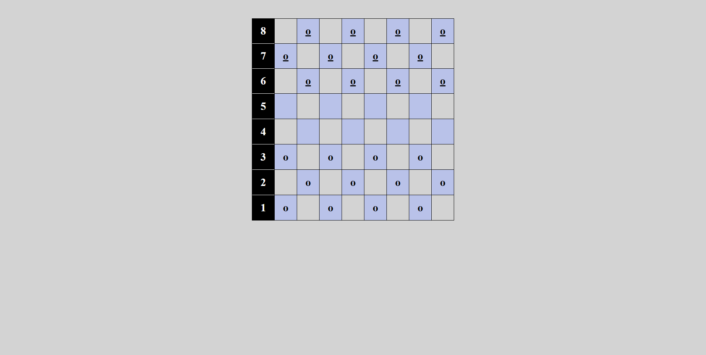

# attemptingChess

## Description: You will have the availitiy to play chess

## How it is organaize:
### Bottom player goes first
### Top player goes second

## How to run the app:
### 1. Git clone this repo
### 2. open index.html in your browser

### You can view the app here
### https://armjim14.github.io/attemptingCheckers/

## Home page

